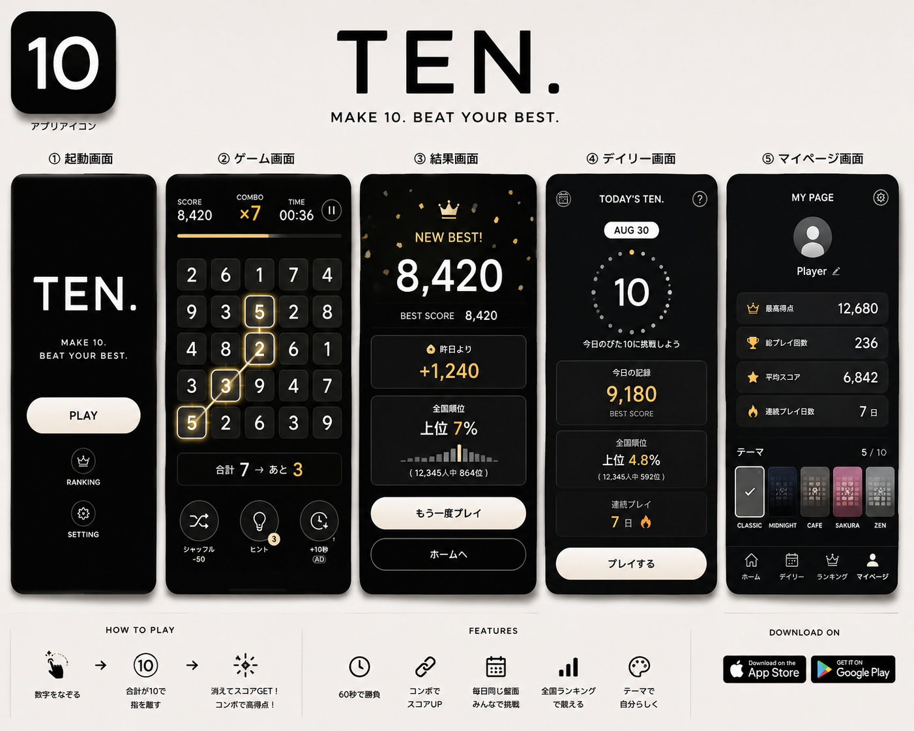
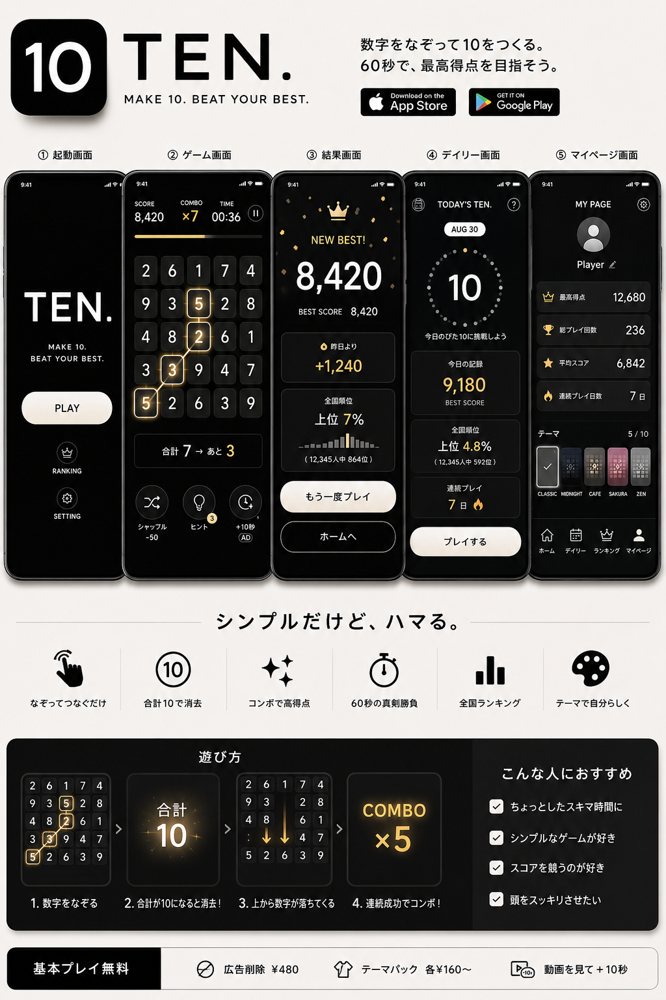

# TEN. プロダクト説明書

## 1. プロダクト概要

**TEN.** は、隣り合う数字を指でつなぎ、合計を「10」にするシンプルな数字パズルゲームです。

- タグライン：`MAKE 10. BEAT YOUR BEST.`
- ジャンル：短時間型・数字パズル
- 主な対象：20〜40代
- 基本プレイ時間：60秒
- 想定端末：スマートフォン中心
- 価値提案：ルールは一瞬で理解でき、短い空き時間に自己ベスト更新を繰り返したくなる体験

子ども向けのにぎやかなゲームではなく、通勤中やカフェでも開きやすい「大人向け1分パズル」を目指します。

## ビジュアル資料

共有チャットで生成された、TEN.の完成イメージです。以下の画像は企画・デザイン上の参考資料であり、表示されているランキング、ストア配信、価格、課金機能などが現在実装済みであることを示すものではありません。

### UIデザインシート

アプリアイコン、起動、ゲーム、結果、デイリー、マイページの各画面と、基本機能を一覧化したデザイン案です。

### プロダクト紹介イメージ

主要画面、遊び方、対象ユーザー、収益化案を1枚にまとめたプロダクト紹介案です。

## 2. ゲームの目的と基本ルール

5×5の盤面に1〜5の数字が並びます。プレイヤーは縦・横・斜めに隣接する数字を、指で途切れずになぞります。

1. 数字を1つ選び、そのまま隣の数字へなぞる
2. 選んだ数字の合計を10にする
3. 合計10で指を離すと数字が消え、上から新しい数字が補充される
4. 制限時間内にできるだけ高いスコアを狙う

合計が10でない場合は得点にならず、コンボがリセットされます。同じマスは1回の選択中に重複利用できません。直前のマスへ戻る操作では選択を1つ取り消せます。

## 3. スコアと継続性

### スコア

現在の試作仕様では、1回の成功で次の得点を獲得します。

`選択した数字の個数 × 100 + (現在のコンボ数 - 1) × 50`

長いつなぎと連続成功ほど高得点になります。

### コンボ

合計10を連続して作るとコンボが増加します。失敗すると0へ戻ります。結果画面には最高コンボを表示します。

### 自己ベスト

最高得点、総プレイ回数、累計得点、平均得点などを端末内に保存し、「昨日の自分・過去の自分を超える」動機を作ります。

## 4. プレイ補助機能

- **ヒント**：隣接する数字の道筋で合計10になる組み合わせを示す。1ゲーム3回
- **シャッフル**：盤面を並べ替える。スコアを50消費し、50点未満では利用不可
- **＋10秒**：動画広告を視聴して制限時間を10秒延長する。1ゲーム1回
- **一時停止**：タイマーを停止・再開する

## 5. 画面構成

### ホーム

ロゴ、タグライン、大きなPLAYボタンを中心にしたミニマルな入口です。ランキングへの導線も置きます。

### ゲーム

上部にスコア、コンボ、残り時間を表示し、中央に5×5の盤面を配置します。盤面下には現在の合計と「10まであといくつか」を表示します。

### 結果

最終スコア、自己ベスト、前回記録との差、順位の目安、最高コンボを表示します。「もう一度プレイ」を主な行動にします。

### TODAY'S TEN.

毎日、全プレイヤーが同じ盤面に挑戦するデイリーモードの入口です。今日の記録、全国順位、連続プレイ日数を表示します。

### ランキング

上位プレイヤーと自分の記録を表示します。デイリーのランキングはCloudflare Worker APIから取得します。

### マイページ

最高得点、総プレイ回数、平均スコア、連続プレイ日数、選択中のテーマを確認します。

## 6. ビジュアルと体験設計

- 黒・白・グレージュを基調に、ゴールドをアクセントとして使用
- 数字を大きく見せ、装飾やメニューを必要最小限に抑える
- 操作音や成功・ボーナス時の効果音、光と短い振動で達成感を強調する
- ダークモードを基本とし、スマートフォンのセーフエリアへ対応する
- テーマ候補：CLASSIC、MIDNIGHT、CAFE、SAKURA、ZEN、NEON（6種類すべて実装済み）

ブランド名は短く大人っぽい **TEN.** とし、アイコンは黒背景に「10」または「TEN.」だけを置く方向です。

## 7. 想定する利用場面

- 通勤・待ち時間：60秒モード
- 休憩時間：3分モード（将来候補）
- 就寝前：時間制限なしモード（将来候補）
- 1日1回の習慣：TODAY'S TEN.

## 8. 習慣化と共有

継続の中心は、他人との強い競争よりも自己更新です。

- 自己ベストまであと何点かを表示
- 昨日の自分との差を表示
- 7日連続などのプレイストリーク
- 全国での上位パーセント表示
- デイリー問題を毎日0時に更新
- スコアを載せた結果画像の生成とWeb Share共有
- 月曜0時（JST）更新の週間ランキング。期間中のデイリー自己ベスト合計で順位を決める
- 短いフレンドコードと相互承認によるフレンド比較。表示名、順位、得点、連続プレイ日数だけを共有する

## 9. 収益化案

無料プレイを妨げない範囲で、次を候補とします。

- 数ゲーム終了後に低頻度の広告
- 動画広告視聴による＋10秒
- 広告の永久削除：約480円
- プレミアム盤面テーマ：160〜320円程度
- 月額VIP：300〜500円程度

金額や商品構成は企画段階の案であり、正式決定ではありません。

### 実装状況

- **ネットワーク**: Google AdMob（[@capacitor-community/admob](https://github.com/capacitor-community/admob) v8 を使用）
- **ネイティブ（Android / iOS）**
  - リワード動画: 「＋10秒」の視聴報酬として表示
  - インタースティシャル: 結果 → ホーム遷移時に控えめ（通常プレイ 3 ゲームに 1 回、クールダウン 90 秒、デイリー対象外、初回 1 ゲームは抑制）
  - AdMob UMP 同意ダイアログ（EU/UK）と iOS App Tracking Transparency に対応
- **Web（開発プレビュー）**: `AdsClient` の `MockClient` 実装が動作し、実機と同じ頻度でリワード/インタースティシャルのモック UI を表示する。右下の `Ads: MOCK ⇄ OFF` トグルでモード切替、`?ads=off` / `?ads=fail` のクエリで挙動を上書きできる
- **広告削除 IAP**: 未実装。`PlayerState` にも広告削除フラグはまだ持たせていない

## 10. 現在の実装範囲

現在のアプリには、次の機能が実装されています。

- 60秒ゲーム、縦・横・斜めのなぞり操作、戻る操作
- スコア、コンボ、ヒント、シャッフル、＋10秒（リワード広告）、一時停止
- 選択・成功・ミス・ボーナス時の効果音と音量設定
- 落下する数字だけが動く盤面アニメーションと、操作方向を考慮したセル選択
- ベストスコア、プレイ回数、履歴、実績（6種）、ストリークの端末内保存
- 日英表示、6種類のテーマ、効果音、振動、動きを減らす設定
- チュートリアル、データの書き出し・復元、記録と設定のリセット
- 結果画像の生成、Web Share API対応端末での直接共有、非対応端末での画像保存
- Service Worker による Web 版のオフラインキャッシュと PWA マニフェスト
- Cloudflare Worker APIによるデイリー盤面、匿名プレイヤー登録、名前変更、ランキング、リプレイ検証
- 署名済み開始トークンによるデイリー提出のプレイヤー・日付・期限検証。デイリーでは一時停止と広告による時間延長を無効化
- 週間ランキング、30日で失効・再発行可能なフレンドコード、相互承認のフレンド比較、直近12週の参照
- 期限切れ認証の自動再登録と、通信エラー時の再試行表示
- GitHub Pages向けWebビルドと、CapacitorによるAndroid・iOSプロジェクト
- Google AdMob によるリワード動画（+10秒の報酬）と低頻度のインタースティシャル広告、Web 用モック UI

次は未実装または外部サービスの本番設定が必要な将来案です。

- FEVERなどの高コンボ専用演出やカットイン
- 3分モード、時間制限なしモード
- PWA のスタンドアロンインストール促進 UI
- 広告削除課金、テーマ購入管理、プレミアム盤面の IAP
- App Store / Google Play 向けの正式な署名・審査・公開

## 11. 正式版に向けた優先事項

1. ゲームルール、得点バランス、盤面生成の継続的な検証
2. FEVERなどの高コンボ専用演出
3. 3分モードと時間制限なしモード
4. アクセシビリティ、実機差、低速・切断時の動作確認
5. 運用環境のCloudflare Worker、D1、KV、シークレット設定
6. 広告削除課金、テーマ販売などの IAP
7. iOS・Androidのストア公開素材、審査対応と配信開始

## 12. 成功指標の候補

- 初回プレイ完了率
- 1セッションあたりの再挑戦回数
- 翌日・7日後の継続率
- TODAY'S TEN.の参加率
- スコア共有率
- 広告視聴率と広告削除購入率
- テーマ購入率

## 13. 一文での説明

**TEN.は、隣り合う数字をなぞって合計10を作り、60秒で自己ベストに挑む、大人向けのミニマル数字パズルです。**

出典：ユーザー提供のChatGPT共有チャット「ゲームアプリ企画作成」（2026年8月30日確認）。本書では、チャット内の企画案と試作コードの内容を整理し、実装済み・試作表示・将来構想を区別しています。
